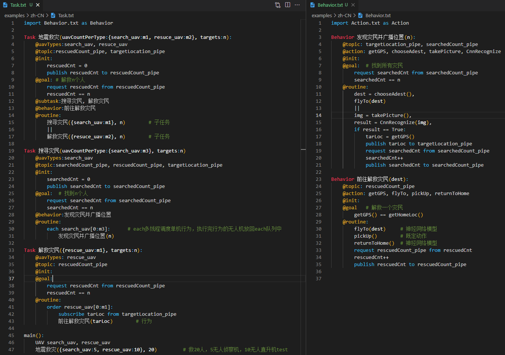

# Swarm

[简体中文](README.zh-CN.md)

Domain Specific Language of Multi-Agent System Based on both Rules and Neural Networks

## Design Principles

The cluster mission of unmanned aerial vehicles (UAVs) can be divided into three layers:

- The **Task** layer, responsible for coordinating and scheduling multiple UAVs for collaboration and information exchange.
- The **Behavior** layer, describing the action sequences of individual UAVs.
- The **Action** layer, which describes the execution process of an atomic action of a UAV. This process is controlled by rule-based or neural network-based syntax.

## Lexcial Conventions
A program consists of one or more translation units stored in a file. The program is reduced to a sequence of tokens.

### Tokens

- Identifiers
- Keywords
- Constants
- Operators

### Identifiers

Identifiers begin with a letter or underscore and consist of letters, digits, or underscores. They are case-sensitive. Identifiers can represent various entities such as variables, task names, behavior names, action names, message topics, agent types, etc.

### Keywords

- Task, Behavior, Action
- @subtask, @behavior, @action
- @uavTypes, @topic, @init, @goal, @routine
- publish, subscribe, request, from, to
- each, order
- if, else, return
- Agent

### Constants
- Integer Constants, also known as decimal integers.
- Floating Constants, consisting of an integer part, a decimal point, and a fractional part.
- String Constants, a sequence of characters surrounded by double quotation quotes, such as `"Hello, swarm."`

### Operators

## Grammar

[EBNF](EBNF.ebnf)

## Examples
To make examples in VSCode highlight as shown in the image, follow these steps:
- install plug-in [**Highlight**](https://marketplace.visualstudio.com/items?itemName=fabiospampinato.vscode-highlight) 
- modify the setting.json of your vscode as [vscode-setting.json](./examples/zh-CN/vscode-settings.json)

