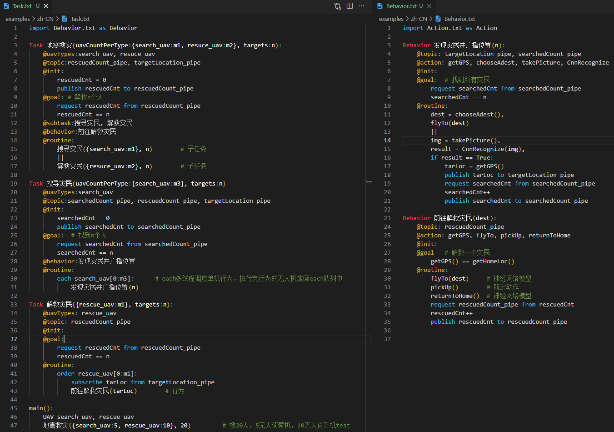

# Swarm

[English](./README.md)

基于规则和神经网络的多智能体系统领域特定语言

## 设计原则 [Design Principles](./README.md/#design-principles)

无人机集群任务可分为三个层级关系

- 多机任务**Task**层，负责调度多架无人机如何协同配合、信息交换
- 单机行为**Behavior**层，负责描述单一无人机的动作序列
- 单一动作**Action**层，描述无人机的一个原子动作的执行过程，该过程由基于规则或基于神经网络的语法进行控制

## 词法规则 [Lexcial Conventions](./README.md/#lexcial-conventions)

程序由存储在文件中的一个或多个翻译单元组成，程序将被归约成一个记号序列。

### 记号 [Tokens](./README.md/#tokens)

- 标识符 Identifiers
- 关键字 Keywords
- 常量 Constants
- 操作符 Operators

### 标识符 [Identifiers](./README.md/#identifiers)

标识符以字母或下划线开始，由字母、数字或下划线构成，大小写敏感。标识符可以指代多种实体：变量、任务名称、行为名称、动作名称、消息话题、智能体类型等。

### 关键字 [Keywords](./README.md/#keywords)

- Task, Behavior, Action
- @subtask, @behavior, @action
- @uavTypes, @topic, @init, @goal, @routine
- publish, subscribe, request, from, to
- each, order
- if, else, return
- Agent

### 常量 [Constants](./README.md/#constants)

- 整数常量，即十进制整数
- 浮点常量，由整数部分、小数点，小数部分组成
- 字符串常量，用双引号引起来的一个字符序列，如 `"Hello, swarm."`

### 操作符 [Operators](./README.md/#operators) TODO

## 数据类型 TODO

1. 布尔
2. 整数
3. 浮点
4. 字符串
5. 字典 `{ agent类型 ：agent数量 }`
6. 切片 `agent类型 [ range_start ~ range_end ]`

## 表达式   TODO

1. 初等表达式：初等表达式包括标识符、常量或带括号的表达式

```ebnf
初等表达式 ::=  标识符 
                | 常量 
                | ( "(" 初等表达式 ")" )
```

2. 后缀表达式：后缀表达式中的运算符遵循从左到右的结合规则

```ebnf
后缀表达式 ::=  初等表达式 
                | 后缀表达式 "[" 范围表达式 "] "                            // 数组引用
                | 后缀表达式 "(" ( 赋值表达式 ( "," 赋值表达式 )* )? ")"     // 函数调用
                | 后缀表达式 "." 标识符                                     //TODO: 结构引用是否需要？
范围表达式 ::= ( 整数常量 | 标识符) "~" ( 整数常量 | 标识符)
            | ( 整数常量 | 标识符) "~" ( 整数常量 | 标识符) "~" ( 整数常量 | 标识符)
            | ( 整数常量 | 标识符) ( "," ( 整数常量 | 标识符) )*
```

3. 乘法类表达式：乘法类运算符 * / % 遵循从左到右的结合性

```ebnf
乘法类表达式 ::= 初等表达式
                | 乘法类表达式 * 初等表达式
                | 乘法类表达式 / 初等表达式
                | 乘法类表达式 % 初等表达式
```

4. 加法类表达式：加法类运算符 + - 遵循从左到右的结合性

```ebnf
加法类表达式 ::= 乘法类表达式
                | 加法类表达式 + 乘法类表达式
                | 加法类表达式 - 乘法类表达式
```

6. 关系表达式：结果为true或false的布尔值

```ebnf
关系表达式 ::= 加法类表达式
                | 关系表达式 < 加法类表达式
                | 关系表达式 <= 加法类表达式
                | 关系表达式 > 加法类表达式
                | 关系表达式 >= 加法类表达式
```

7. 相等类表达式：结果为true或false的布尔值，优先级低于关系表达式

```ebnf
相等类表达式 ::= 关系表达式
                | 相等类表达式 == 关系表达式
                | 相等类表达式 != 关系表达式
```

8. 逻辑与表达式：遵循从左到右的结合性

```ebnf
逻辑与表达式 ::= 相等类表达式
                | 逻辑与表达式 "and" 相等类表达式
```

9. 逻辑或表达式：遵循从左到右的结合性

```ebnf
逻辑或表达式 ::= 逻辑与表达式
                | 逻辑或表达式 "or" 逻辑与表达式
```

10. 赋值表达式：将赋值运算符右侧的值赋给左侧的对象

```ebnf
赋值表达式 ::= 逻辑或表达式
                | 标识符 "=" 逻辑或表达式
                | 标识符 "=" 后缀表达式     // FIXME: 只能是函数调用，但后缀包含数组和结构引用
```

## 语句 TODO

语句是顺序执行的。语句执行都有一定的结果，但没有值。

1. 复合语句：也称程序块，函数定义中的函数体就是一个复合语句

```ebnf
复合语句 ::= ( 消息语句 | 表达式语句 | 选择语句 | 返回语句 )*      // FIXME: 并行符号还未定义
```

2. 消息语句：描述agent之间通信的消息发送

```ebnf
消息语句 ::= "publish" 初等表达式 "to" 消息管道
            | "subscribe" 初等表达式 "from" 消息管道
            | "request" 初等表达式 "from" 消息管道
消息管道 ::= 标识符
```

3. 表达式语句：大部分语句为表达式语句。大多数表达式语句为赋值语句或函数调用语句，没有表达式的语句称为空语句

```ebnf
表达式语句 ::= 赋值表达式?
```

4. 选择语句：

```ebnf
选择语句 ::= "if" 逻辑或表达式 ":" 复合语句 ( "else" 复合语句 )?
```

5. 返回语句：用于返回函数执行结果

```ebnf
返回语句 ::= "return" 逻辑或表达式
```

## 声明及定义 TODO

声明用于描述标识符的含义，定义用于描述函数的执行过程。

1. agent声明及初始化：定义agent的类型及数量

```ebnf
agent声明及初始化 ::= "Agent" agent类型 "=" 整数常量               // FIXME: 赋值表达式？
agent类型 ::= 标识符
```

2. agent调用（切片）    //TODO:
3. 函数定义：包含Task任务函数、Behavior行为函数、Action动作函数     // FIXME: 函数声明？函数定义？

```ebnf
函数定义 ::= 函数类型 标识符 "(" 形式参数表? "):"  程序节+
函数类型 ::= "Task" | "Behavior" | "Action"
形式参数表 ::= 标识符
                | 形式参数表 "," 标识符
程序节 ::= 程序节符 复合语句
程序节符 ::= "@subtask" | "@behavior" | "@action" | "@uavTypes" | "@topic" | "@init" | "@goal" | "@routine"
```

4. 函数调用 //TODO:

## 作用域与文件包含 TODO

## 语法 [Grammar](./README.md/#grammar)

[EBNF](EBNF.ebnf)

## 范例 [Examples](./examples)

按下述步骤让范例在vscode如下图一样高亮显示

- 安装插件 [Highlight](https://marketplace.visualstudio.com/items?itemName=fabiospampinato.vscode-highlight)
- 按照 [vscode-setting.json](./examples/zh-CN/vscode-settings.json) 修改你的 vscode 中的配置文件 setting.json


